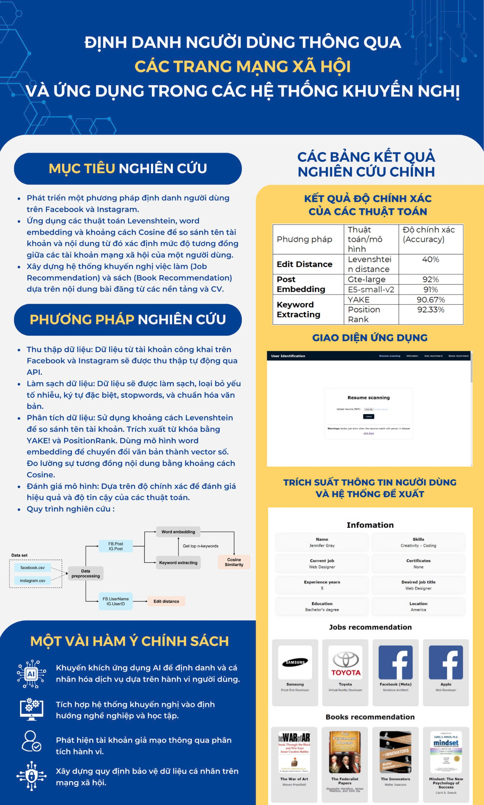
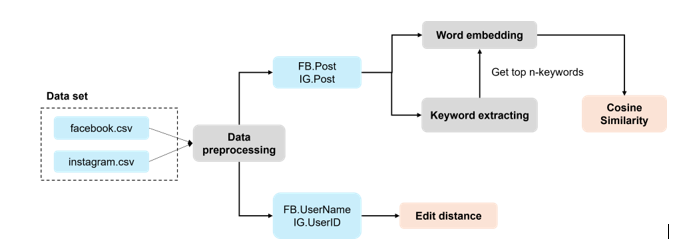
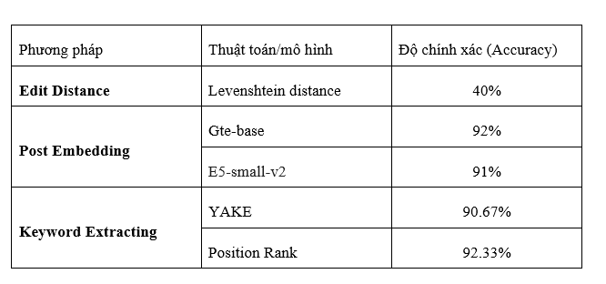
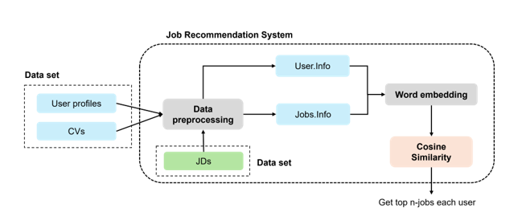
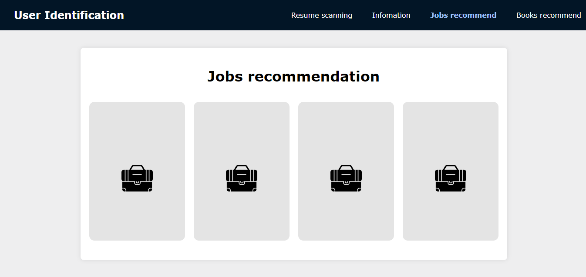
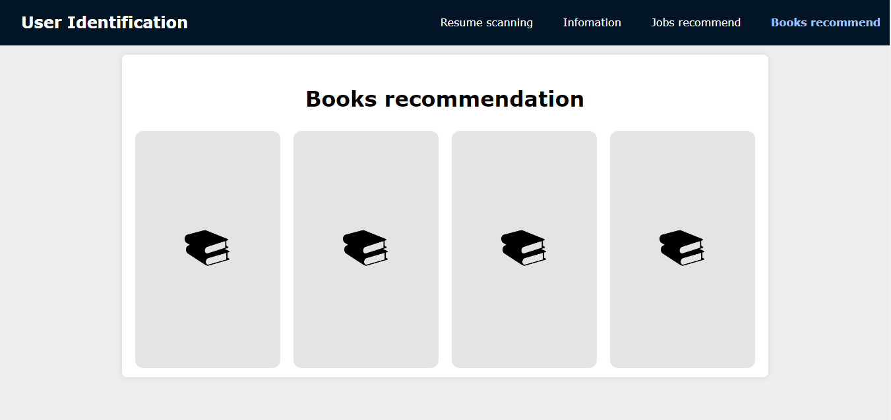
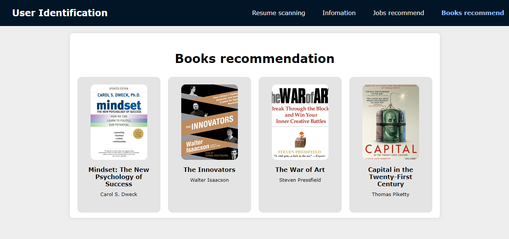

# USER IDENTIFICATION

## 1. My Team

- Nguyen Anh Tuan
- Thai Bao An
- Le Nhat Hoan Vu
- Dao Viet Cuong
- Nguyen Hoang Hai

## 2. Introduction

Social media platforms have become integral to daily life, particularly in the post-COVID-19 era, where digital interaction has expanded significantly. Platforms like Facebook and Instagram store vast amounts of user data, including personal information, interests, and behaviors. However, users often maintain multiple accounts on different platforms, which creates a challenge in identifying whether these accounts belong to the same person. Addressing this challenge is crucial for building unified user profiles that have wide-ranging practical applications, such as expert profiling, item recommendations (on platforms like Shopee, Lazada, Tiki, and Netflix), online marketing, user clustering, and personalized job matching (on platforms like LinkedIn).

The study explores how user identification can improve search efficiency within professional networks, enhance product recommendations, optimize targeted marketing strategies, and facilitate the clustering of users into groups based on shared interests. The introduction also discusses the practical applications of this identification process in expert profiling, where user profiles can help with tasks like locating specialists in specific fields or recommending research collaborators.

## 3. Research Objectives

The primary objective of the research is to develop a set of methods that effectively identify users across different social media platforms, particularly Facebook and Instagram. The study aims to:

- **Determine User Similarity:** Develop algorithms to identify similarities between multiple social media accounts a user might own, enabling accurate user identification across platforms.

- **Apply NLP Algorithms:** Use EDIT-distance, word embedding, and cosine similarity to compare account names and user-generated content. This approach helps identify whether content on different platforms originates from the same user.

- **Create Recommendation Systems:** The research aims to build two main recommendation systems: one for job recommendations and another for book recommendations. These systems are designed to suggest relevant jobs or books to users based on their social media posts and interests.

- **Evaluate Model Effectiveness:** Assess the performance of different models and algorithms in identifying users across platforms and optimize their accuracy through iterative improvements. The study also explores how these models can be applied in real-world scenarios, such as improving personalized recommendations and detecting fake or duplicate accounts.

## 4. Methodology
The research employs Natural Language Processing (NLP) techniques to achieve its objectives, with the three primary methods being:

- **EDIT-distance (Levenshtein Distance):** This method is used to calculate the number of operations required to transform one string into another. It is particularly useful for comparing account names across platforms, determining whether small variations in account names are due to user error or intentional modifications. However, the study finds that this method has limited accuracy in identifying users due to the diversity of account names across platforms.

- **Word Embedding with Cosine Similarity:** This method involves converting textual data into numerical vectors that represent the semantic relationships between words. Using models like E5-small-v2 and GTE-base, the research transforms user posts into vectors, which are then compared using cosine similarity to determine how semantically similar the posts are. Cosine similarity measures the cosine of the angle between two vectors, with values closer to 1 indicating greater similarity. This method proves to be highly effective in identifying users based on the content of their posts.

- **Keyword Extraction with Cosine Similarity:** In this method, the research uses algorithms like YAKE! and PositionRank to automatically extract key phrases from user posts, which are then used to identify the main topics of interest for each user. The extracted keywords are converted into vectors, and cosine similarity is used to compare them across different platforms. This method helps identify users based on the topics they frequently discuss.

Additionally, the research uses Python and Jupyter Notebook for data analysis and processing. Key libraries such as NLTK, Sentence-Transformers, and PKE play a significant role in supporting data preprocessing, embedding generation, and keyword extraction. Data is collected from public social media accounts, and the study uses approximately 300 user profiles and 9,000 posts from both Facebook and Instagram for analysis.

## 5. Results

The study reveals significant differences in the effectiveness of the three methods for user identification:

- **EDIT-distance:** This method, which focuses on comparing account names, achieved only 40% accuracy. The low accuracy indicates that account names vary significantly across platforms, making them an unreliable basis for user identification. Users often modify their account names on different platforms, whether due to platform-specific preferences or intentional customization.

- **Word Embedding with Cosine Similarity:** This method proved to be highly effective, achieving 92% accuracy using the GTE-base model and 91% accuracy with the E5-small-v2 model. The high accuracy of this method demonstrates that analyzing the semantic content of user posts is a far more reliable approach for identifying users across platforms. Users tend to post similar content across their accounts, even if the wording or formatting differs slightly.

- **Keyword Extraction with Cosine Similarity:** Similarly, this method achieved 92.33% accuracy using PositionRank and 90.67% accuracy using YAKE!. The ability to identify key topics and compare them across platforms highlights the importance of topic-based identification in understanding users’ interests and behaviors.

The high accuracy rates for the content-based methods (word embedding and keyword extraction) show that analyzing the content of user posts provides a strong foundation for identifying users across platforms. The study concludes that while account names may vary, users' interests and behaviors remain consistent across platforms, making content-based methods more reliable for identification.

## 6. Conclusion

The research concludes that content-based identification methods—such as word embedding with cosine similarity and keyword extraction with cosine similarity are significantly more effective than name-based methods (EDIT-distance). The high accuracy of the content-based methods demonstrates that users' posts across platforms often reflect their consistent interests and behaviors, even if the specific wording or format varies. This consistency allows for more reliable user identification and provides a foundation for building personalized recommendation systems.

The study also suggests that future research could improve user identification by collecting more comprehensive data over a longer period. Tracking users' behavior and interests over time could help identify patterns of change and improve the accuracy of identification algorithms. Additionally, incorporating factors like geographical location, posting time, and language differences could further enhance the reliability of user identification across platforms.

## 7. Apply in Jobs and Books Recommendation

### Plan

### Jobs Recommendation

- **Understanding User Interests and Skills:** By analyzing user-generated content across platforms like Facebook and Instagram, the system can build a detailed profile of the user’s skills, experiences, and interests. For example, posts that mention job-related activities, discussions about work experiences, or engagement in certain fields (e.g., software development, design, management) can help the system identify the user’s professional background.

- **Matching Job Opportunities:** Using word embedding with cosine similarity, the system compares the content of a user's posts and their profile information to job descriptions available on job platforms such as LinkedIn. For instance, if a user frequently posts about programming languages or software projects, the system can match them to job opportunities in software development. The system evaluates the semantic similarity between the user's posts and the job descriptions to recommend the most relevant job listings.

### Books Recommendation

- **Identifying Reading Preferences:** By analyzing the topics a user frequently discusses across social media platforms (using keyword extraction), the system can identify the user’s reading preferences. For instance, if a user often posts about business strategies, entrepreneurship, or self-help topics, the system can infer that they are likely interested in books within those genres.

- **Matching Books to User Interests:** Using word embedding with cosine similarity, the system can compare the user’s content to book summaries, reviews, and descriptions. For example, if a user shares content related to technology and innovation, the system can recommend books that align with those interests, such as recent publications on artificial intelligence, startups, or tech trends. The system ensures that recommended books are semantically related to the topics the user engages with on social media.

## 8. Deploy Application Website

### The Interface

### After Upload Resume

## 8. How to set up this project

### Run in localhost
- **Step 1:** Unpack e5_small.rar
- **Step 2:** Run application.py

### Website

Scan this QR code to visit my website

 # Application_System
